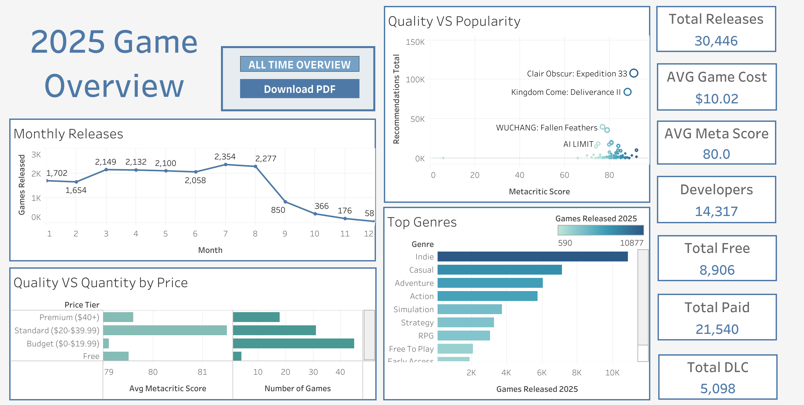
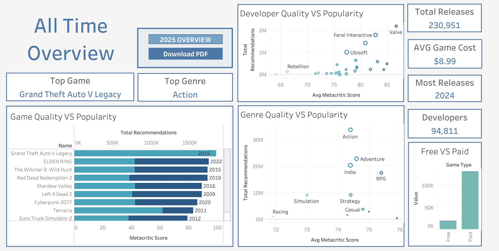

# Steam Dataset 2025 Analysis

## Project Overview
A Simple data analysis of Steam's gaming ecosystem, examining 239,664 games to uncover trends in player preferences, pricing strategies, and market dynamics. This project demonstrates data analysis skills from database design through visualization.

**[View Dashboards on Tableau Public](https://public.tableau.com/views/SteamDatasetAnalysis/AllTime?:language=en-US&publish=yes&:sid=&:redirect=auth&:display_count=n&:origin=viz_share_link)**




---

## Key Findings

### 2025 Gaming Trends
- **Indie Dominance**: Indie games led 2025 releases with 10,877 titles (35.7% of all releases)
- **Pricing Strategy**: Average game price of $10.02, representing a 12% increase over the historical average of $8.96
- **Budget Gaming**: Budget tier ($0-$19.99) makes up the majority of releases while maintaining competitive quality (79 vs 81 Metacritic score for Premium games)
- **Release Patterns**: July 2025 recorded peak release activity with 2,354 games, strategically timed at Summer breaks for schooling
- **Breakout Success**: Clair Obscur: Expedition 33 emerged as 2025's standout title, achieving the highest combination of critical acclaim and player recommendations

### All-Time Market Insights
- **Market Size**: Analyzed 230,951 total games across Steam's history
- **Player Favorites**: Grand Theft Auto V Legacy maintains the highest player engagement with 1.7M+ recommendations
- **Genre Leadership**: Action genre dominates in both critic scoring and player popularity
- **Peak Year**: 2024 recorded the highest number of game releases in Steam's history
- **Market Split**: Paid games outnumber free-to-play titles approximately 2.4:1 (100K vs 42K)
- **Developer Ecosystem**: 94,811 unique developers, showcasing the platform's accessibility to creators

### Quality vs. Popularity Analysis
- **Developer Performance**: Major studios (Valve, Ubisoft, Feral Interactive) consistently balance critical acclaim with mass appeal
- **Genre Sweet Spots**: RPG and Adventure genres achieve strong ratings while maintaining substantial market presence
- **Price-Quality Gap**: Minimal quality difference between Premium ($40+) and Budget games despite significant price disparity (81 vs 79 Metacritic average)

---

## Technical Implementation

### Tools & Technologies
- **Database**: MySQL 8.0
- **ETL/Data Import**: Python 3.x (pandas, mysql-connector-python)
- **Data Analysis**: SQL
- **Visualization**: Tableau Public

### Skills Demonstrated
- **SQL Proficiency**
  - Complex multi-table JOINs across 11 relational tables
  - Aggregate functions with GROUP BY and HAVING clauses
  - CASE statements for data categorization and normalization
  - Data type conversion and handling (CAST, string manipulation)
  - Window functions for advanced analytics
  - Query optimization for large datasets (239K+ records)

- **Data Engineering**
  - Designed and implemented relational database schema
  - Automated ETL pipeline using Python
  - Data normalization (consolidated 8+ variations of developer names)
  - Handled missing values and data quality issues
  - Performance optimization for queries on large datasets

- **Data Visualization**
  - Interactive Tableau dashboards with multiple visualization types
  - Scatter plots, dual-axis charts, treemaps, and time-series analysis
  - Color theory and design principles for data presentation
  - Dashboard storytelling and insight communication

- **Data Cleaning & Preparation**
  - Identified and filtered statistical outliers (prices >$150)
  - Handled null values and invalid data ('nan' strings)
  - Normalized inconsistent naming conventions across 94K+ developers
  - Converted data types for proper sorting and analysis

---

## Project Structure
```
steam-2025-analysis/
├── sql_queries/
│   └── 2025_overview   # 2025 analysis queries
    └── all_time   # all time analysis queries
├── python/
│   └── import_dataset.py               # Database import script
├── screenshots/
│   ├── 2025_overview.png                  # Dashboard screenshots
│   └── all_time.png

```

---

## Dashboards

### 2025 Game Overview
Analyzes current year trends including:
- Monthly release patterns
- Genre distribution and popularity
- Price tier analysis (Free, Budget, Standard, Premium)
- Quality vs. popularity scatter analysis
- Key performance metrics (total releases, avg price, avg score)

**Key Insights**: July release surge, indie game dominance, budget pricing strategy effectiveness

### All-Time Overview
Comprehensive historical analysis featuring:
- Top games by player recommendations
- Developer performance (quality vs. popularity)
- Genre market dynamics
- Free vs. paid game comparison
- Historical market size and growth

**Key Insights**: GTA V's enduring popularity, Action genre dominance, developer consistency patterns

---
## Data Source

**Dataset**: [Steam Dataset 2025 - Multi-Modal Gaming Analytics](https://www.kaggle.com/datasets/crainbramp/steam-dataset-2025-multi-modal-gaming-analytics)

**Database Structure**:
- **Main Table**: `applications` (239,664 records)
  - Game metadata, pricing, ratings, recommendations
- **Lookup Tables**: `genres`, `developers`, `publishers`, `categories`, `platforms`
- **Junction Tables**: `application_genres`, `application_developers`, etc.
  - Enables many-to-many relationships

**Key Metrics**:
- Metacritic scores (critic ratings)
- Recommendations total (player engagement)
- Release dates, pricing, platform support

---

## Business Impact & Applications

This analysis provides actionable insights for:

**Game Developers**:
- Optimal pricing strategies based on quality-price correlation analysis
- Release timing recommendations (avoid September saturation)
- Genre market opportunity identification

**Publishers**:
- Market positioning strategies
- Competitive landscape understanding
- Investment decision support

**Platform Operators**:
- Developer ecosystem health monitoring
- Market trend identification
- Content curation priorities

---
